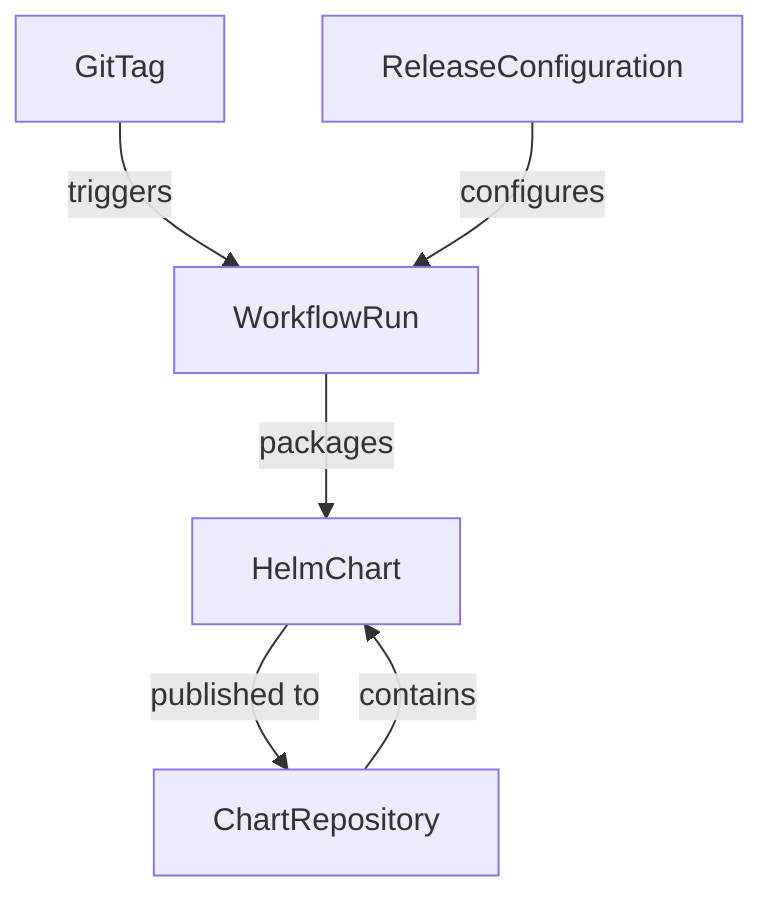

# Data Model: Automated Helm Chart Release

**Feature**: 002-helm-chart-release | **Date**: 2025-11-23

## Overview

This feature primarily involves CI/CD configuration and workflow automation. The data model consists of configuration entities and workflow state rather than traditional database entities.

## Core Entities

### 1. GitTag
**Description**: Version tag that triggers the release workflow
**Source**: Git repository tags

| Field | Type | Validation | Description |
|-------|------|------------|-------------|
| name | string | ^v[0-9]+\.[0-9]+\.[0-9]+$ | Semantic version tag (e.g., v1.2.3) |
| ref | string | refs/tags/* | Full git reference |
| sha | string | [a-f0-9]{40} | Git commit SHA |
| timestamp | datetime | ISO 8601 | Tag creation time |

### 2. HelmChart
**Description**: Helm chart package to be released
**Source**: charts/supabase-operator/

| Field | Type | Validation | Description |
|-------|------|------------|-------------|
| name | string | supabase-operator | Chart name (fixed) |
| version | string | SemVer | Chart version from tag |
| appVersion | string | SemVer | Application version |
| description | string | Max 140 chars | Chart description |
| digest | string | sha256:* | Package checksum |
| created | datetime | ISO 8601 | Package creation time |
| urls | array[string] | Valid URLs | Download locations |

### 3. ChartRepository
**Description**: GitHub Pages repository hosting charts
**Source**: Configuration

| Field | Type | Validation | Description |
|-------|------|------------|-------------|
| owner | string | STRRL | Repository owner |
| name | string | helm.strrl.dev | Repository name |
| branch | string | gh-pages | Publishing branch |
| url | string | https URL | Public access URL |
| index | object | Valid YAML | Repository index.yaml |

### 4. WorkflowRun
**Description**: GitHub Actions workflow execution
**Source**: GitHub Actions API

| Field | Type | Validation | Description |
|-------|------|------------|-------------|
| id | number | Positive int | Workflow run ID |
| status | enum | queued\|in_progress\|completed | Current status |
| conclusion | enum | success\|failure\|cancelled | Final result |
| trigger | string | Tag name | Triggering tag |
| duration | number | Seconds | Execution time |
| logs_url | string | Valid URL | Logs location |

### 5. ReleaseConfiguration
**Description**: Static configuration for the release process
**Source**: Workflow file and secrets

| Field | Type | Validation | Description |
|-------|------|------------|-------------|
| token_name | string | HELM_REPO_TOKEN | Secret name for PAT |
| charts_dir | string | Valid path | Source charts directory |
| target_url | string | https URL | Target repository URL |
| linting | boolean | true/false | Enable chart validation |
| signing | boolean | true/false | Enable chart signing (future) |

## Relationships



## State Transitions

### WorkflowRun States
```
[Tag Push] → queued → in_progress → completed(success)
                          ↓
                      completed(failure)
```

### Chart Lifecycle
```
[Source] → Validated → Packaged → Published → Indexed → Available
              ↓           ↓          ↓
           [Failed]   [Failed]   [Failed]
```

## Validation Rules

### Tag Validation
- MUST match pattern `v[0-9]+.[0-9]+.[0-9]+`
- MUST NOT be duplicate of existing release
- MUST reference valid commit

### Chart Validation
- MUST pass `helm lint` checks
- MUST contain required metadata fields
- MUST have unique version number
- Chart.yaml version MUST match tag version (without 'v' prefix)

### Repository Validation
- Target repository MUST exist
- gh-pages branch MUST be initialized
- PAT MUST have write permissions
- Index.yaml MUST be valid Helm repository index

## Data Flow

1. **Input**: Developer pushes semantic version tag
2. **Extraction**: Workflow extracts version from tag name
3. **Transformation**: Version applied to Chart.yaml
4. **Packaging**: Helm creates .tgz archive with metadata
5. **Publishing**: Archive pushed to gh-pages branch
6. **Indexing**: Repository index.yaml updated with new version
7. **Output**: Chart available at public URL

## Storage Locations

| Data Type | Storage Location | Retention |
|-----------|------------------|-----------|
| Source charts | charts/supabase-operator/ | Permanent |
| Workflow config | .github/workflows/ | Permanent |
| Packaged charts | gh-pages branch | Permanent |
| Repository index | gh-pages/index.yaml | Permanent |
| Workflow logs | GitHub Actions | 90 days |
| Secrets | GitHub Secrets | Until rotated |

## Security Considerations

### Sensitive Data
- **PAT Token**: Stored as encrypted GitHub Secret, never exposed in logs
- **GPG Key** (future): Private key for chart signing, stored encrypted

### Access Control
- Write access to gh-pages branch restricted to workflow
- PAT scoped to minimum required permissions
- Workflow triggered only by authorized tag pushers

## Error Handling

| Error Type | Handling | Recovery |
|------------|----------|----------|
| Invalid tag format | Skip workflow | Push correct tag |
| Lint failure | Fail workflow | Fix chart and retag |
| Network failure | Fail workflow | Retry tag push |
| Permission denied | Fail workflow | Fix PAT permissions |
| Concurrent release | Queue execution | Automatic retry |

## Metrics & Monitoring

| Metric | Source | Purpose |
|--------|--------|---------|
| Release frequency | Workflow runs | Track release cadence |
| Success rate | Workflow conclusions | Quality indicator |
| Release duration | Workflow timing | Performance tracking |
| Chart downloads | GitHub insights | Adoption metrics |
| Failed releases | Workflow failures | Issue detection |

## Future Extensions

1. **Multi-chart support**: Extend model to handle multiple charts
2. **Signing metadata**: Add GPG signature fields
3. **Approval workflow**: Add approval state before publishing
4. **Rollback tracking**: Track rollback operations
5. **Dependency graph**: Model chart dependencies